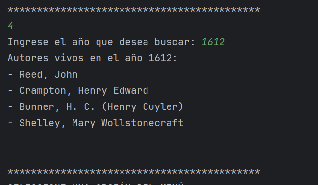
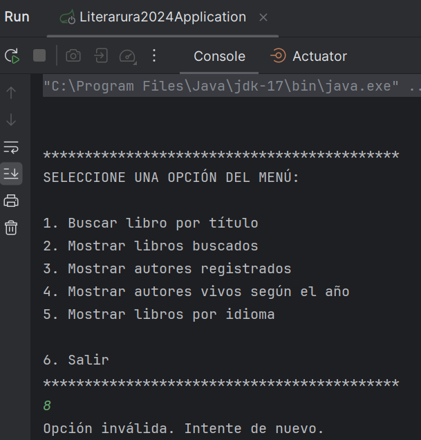
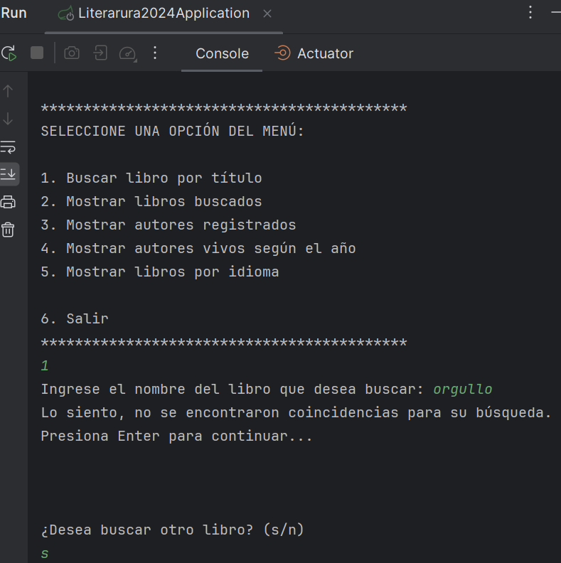
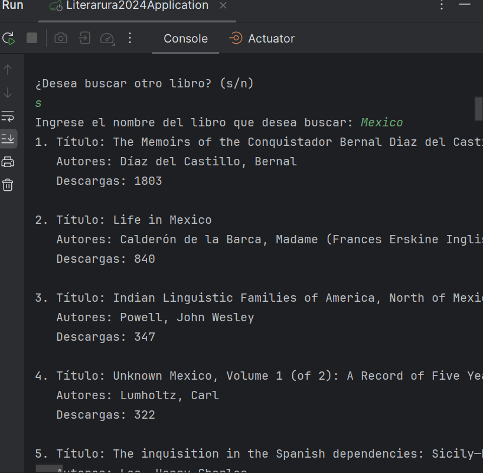
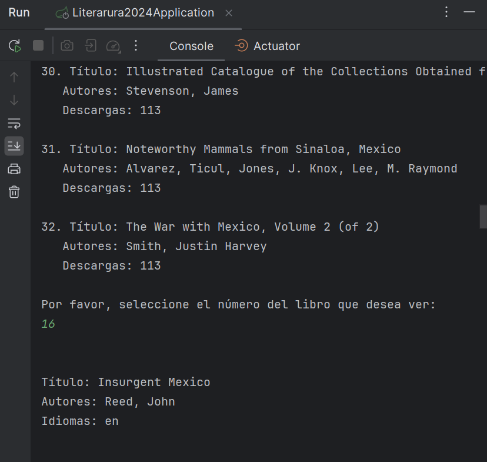
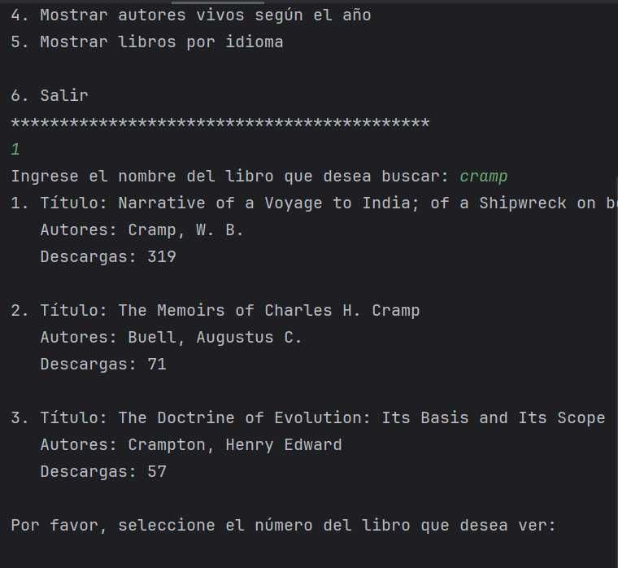
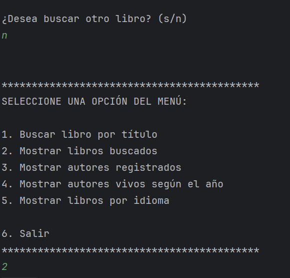
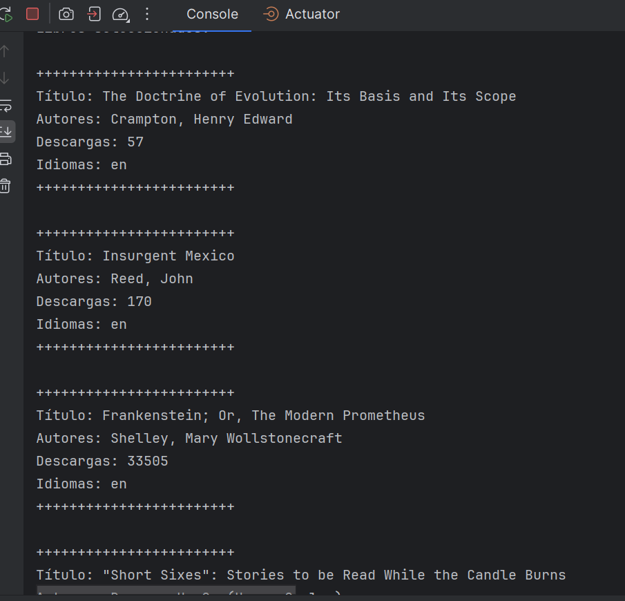
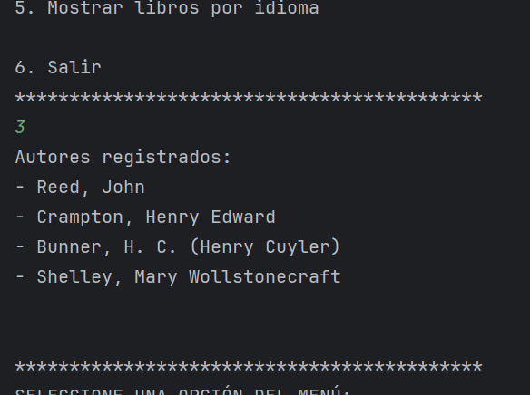
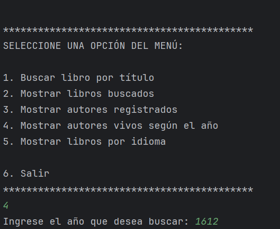

# LiterAlura2024

## 📖 Descripción
En este proyecto hacemos un primer acercamiento a la conexión con bases de datos, consumiendo una API Rest que incluye información de libros. Para más detalles sobre cómo utilizar la API, consulta la documentación completa probando la API. Si tienes preguntas o necesitas soporte, no dudes en contactarme como creador del proyecto.
## 🔨 Funcionalidades
- `Buscar Libro por Titulo`: Devuelve una lista completa de todos los tópicos disponibles en la base de datos.
- `Mostrar Libros Buscados`: Permite a los usuarios editar la información de un tópico existente.
- `Mostrar autores registrados`: Permite a los usuarios eliminar un tópico específico.
- `Mostrar Autores vivos en tal año`: Permite a nuevos usuarios registrarse en la aplicación proporcionando sus detalles básicos.
- `Mostrar Libros por idioma`: Permite a los usuarios registrados modificar sus datos de perfil.

## 🕹️ Uso
Esta es una muestra, a grandes rasgos, del propósito que cumple esta primera versión.

Corremos nuestro programa en IntelliJ. Nos muestra el menú y, primeramente, probamos una opción no considerada en este:

Tenemos, nuevamente, la opción de elegir un número del menú. Elegiremos la primer opcion. Ingresamos una palabra que sabemos que no está en la API, para ver cómo se comporta el programa🤟:

Al no encontrar resultados, nos pregunta si deseamos hacer otra búsqueda. Elegimos que sí y ponemos una palabra que coincide con varios libros:

El programa nos arroja las posibles coincidencias de nuestra búsqueda y nos pide elegir número del libro que deseamos ver, imprimiendo inmediatamente la información reelevante de nuestra elección🤟:

Podemos hacer una siguiente búsqueda y repetir el procedimiento. Es importante señalar que el programa busca coincidencias con titulo y autor:

Cuando hayamos terminado de buscar los libros que querramos ver, estos registros quedarán en la base de datos. Podemos ahora pasar a elegir la opción 2 del menú principal🤟:

Tenemos la lista de todos los libros que hasta el momento hemos buscado:

Podemos seleccionar la opción 3 para listar por autores:

Ahora le pedimos al programa que busque autores según el año🤟:

Por último mostramos libros por idioma:

## ✔️ Tecnologias
Hice uso de las siguientes tecnologias para lograr la construccion de este proyecto.
 
- [Postgres](https://www.postgresql.org/)
- [SpringBoot](https://spring.io/projects/spring-boot)
- [IntelliJ IDEA](https://www.jetbrains.com/idea/)
- [Spring Initializr](https://start.spring.io/)

## 👨‍💻 Sobre el Autor
Guz Mexía, mexicano radicado en Francia que busca dar un giro en su carrera profesional aprendiendo sobre tecnología🏰. 

